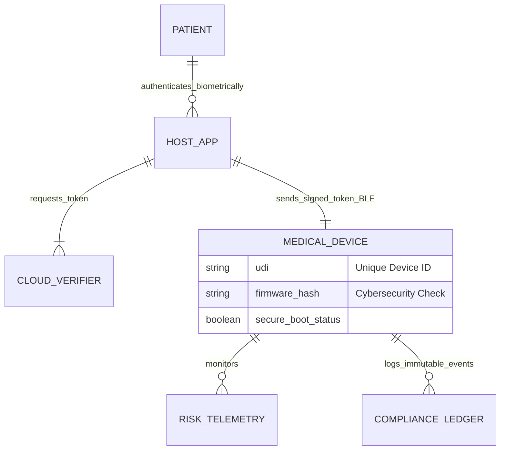

# Gemini-effective-guide
Running a test by refactoring a solution that breaks the literal infringement of US 11,989,990 B2

### Architecture
#### **ERD Visualisation**

```mermaid
erDiagram
    PATIENT ||--o{ HOST_APP : "authenticates_biometrically"
    HOST_APP ||--|{ CLOUD_VERIFIER : "requests_token"
    HOST_APP ||--|| MEDICAL_DEVICE : "sends_signed_token_BLE"
    MEDICAL_DEVICE ||--o{ RISK_TELEMETRY : "monitors"
    MEDICAL_DEVICE ||--o{ COMPLIANCE_LEDGER : "logs_immutable_events"
    
    MEDICAL_DEVICE {
        string udi "Unique Device ID"
        string firmware_hash "Cybersecurity Check"
        boolean secure_boot_status
    }

```
